## 프로세스의 개념
* 프로세스 == 실행 중인 프로그램
* 프로세스 == CPU와 메모리 등 하드웨어가 특정 시점에 가지고 있는 상태들의 집합
    * 메모리
        * 명령어 저장
        * 데이터 저장
    * 레지스터
        * 프로그램 카운터(PC: Program Counter) (= 명령어 포인터 (IP: Instruction Pointer)): 프로그램의 어느 명령어가 실행 중인지를 가리킴
        * 스택 포인터(Stack Pointer) & 프레임 포인터(Frame Pointer): 함수의 변수와 리턴 주소를 저장하는 스택을 관리할 때 사용
    * 영구 저장 장치(Persistent Storage)
        * 프로세스가 현재 열어 놓은 파일 목록

#### 프로세스 생성
프로그램 -> 프로세스로 전환시키려면 어떻게 해야할까? 어떻게 프로그램을 준비하고 실행시켜야할까?
1. 프로그램 코드와 정적 데이터를 메모리, 프로세스의 주소 공간에 load (lazy loading, paging, swapping)
2. 지역 변수, 함수 인자, 리턴 주소 등의 정적 데이터를 저장하기 위해 스택 할당
3. 가변적인 자료 구조를 저장하기 위한 힙 할당
4. 입출력 관련 초기화 작업 (파일 디스크립터 - 표준 입력, 표준 출력, 표준 에러)
5. main() 실행

#### 프로세스 상태
1. 실행(Running): 프로세서에서 명령어를 **실행** 중인 상태
2. 준비(Ready): 실행 준비가 되어있지만 운영체제에 의해 **대기**중인 상태
3. 대기(Blocked): CPU 할당, CPU 반납, I/O 요청, I/O 완료 등 다른 이벤트를 기다리는 동안 **중단**된 상태

#### 프로세스 정보 저장 자료구조
* 프로세스 리스트(process list): 시스템 상에 존재하는 모든 프로세스에 대한 정보
* 레지스터 문맥(register context): 프로세스 중단 시점의 레지스터값 저장 목록

### 📖 문제
𝐐1. 다음과 같이 플래그를 지정하고 프로그램을 실행시키시오: ./process-run.py -l 5:100,5:100. CPU 이용률은 얼마가 되어야 하는가(예: CPU가 사용 중인 시간의 퍼센트) 그러한 이용률을 예측한 이유는? -c 플래그를 지정하여 예측이 맞는지 확인하시오.  

𝐀1. 100%. 두 프로세스 모두 cpu만 사용하므로 cpu를 점유하기 때문이다.
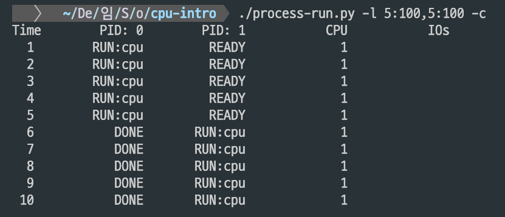

𝐐2. 이제 다음과 같이 플래그를 지정하고 실행시키시오: ./process-run.py -l 4:100,1:0. 이 플래그는 4개의 명령어를 실행하고 모두 CPU만 사용하는 하나의 프로세스와 오직 입출력을 요청하고 완료되기를 기다리는 하나의 프로세스를 명시한다. 두 프로세스가 모두 종료되는 데 얼마의 시간이 걸리는가? -c 플래그를 사용하여 예측한 것이 맞는지 확인하시오. 

𝐀2. 11tick이 걸린다. io는 5tick, cpu 점유는 1tick이 소요되며, 4:100는 cpu 점유 명령어 4개, 1:0는 io 요청 1개를 의미한다. 이 때 cpu 점유에 4tick, io 시작 1tick, io 대기 5tick, io 완료 1tick 총 11tick이다.
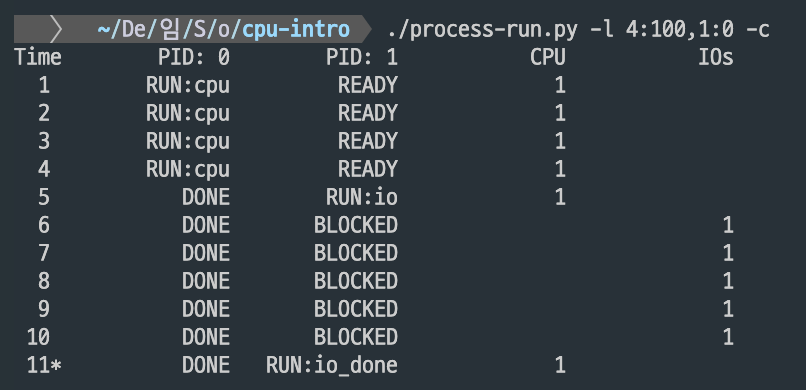
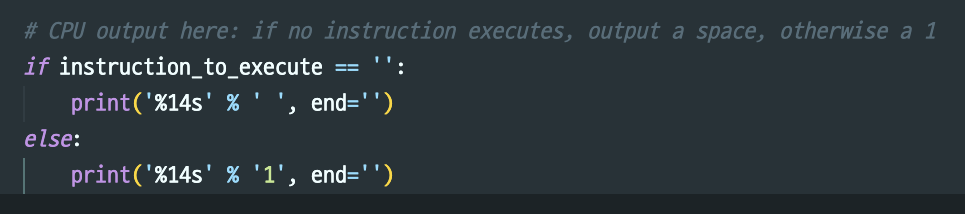
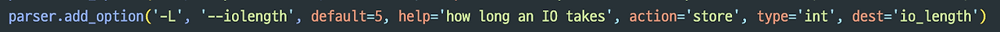

𝐐3. 옵션으로 지정된 프로세스의 순서를 바꾸시오: ./process-run.py -l 1:0,4: 100.
이제 어떤 결과가 나오는가? 실행 순서를 교환하는 것은 중요한가? 이유는 무엇인가? -c 플래그를 사용하여 예측이 맞는지 확인하시오. 
 
𝐀3. 실행 순서는 중요하다. 왜냐하면 io 요청을 먼저 처리하면 io가 BLOCKED될 때 cpu 작업이 실행되어 병렬처리 되기 때문이다. 즉, BLOCKED 시점부터 cpu 작업이 가능해서 io 시작 1tick, io 대기 5 tick (+ 4tick 짜리 cpu 작업 병렬처리), io 완료 1tick 총 7tick으로 단축된다.

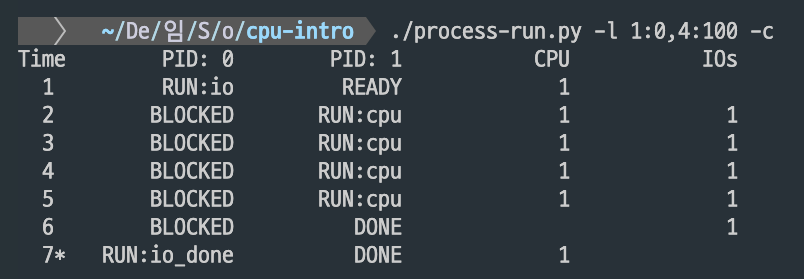

𝐐4. -S 플래그는 프로세스가 입출력을 요청했을 때 시스템이 어떻게 반응하는지를 결정한다. 이 플래그가 SWITCH_ON_END로 지정되면 시스템은 요청 프로세스가 입출력을 하는 동안 다른 프로세스로 전환하지 않고 대신 요청 프로세스가 종료될 때까지 기다린다. 입출력만 수행하는 프로세스와 CPU 작업만 하는 프로세스 두 개를 실행시키면 어떤 결과가 발생하는가? (-l 1:0,4:100 -c -S SWITCH_ON_END)  

𝐀4. 2번 상황과 같이 11tick이 소요된다. io 대기 중에도 cpu 작업 프로세스로 전환하지 않고 현재 프로세스가 완전히 끝날 때까지 기다리기 때문이다.
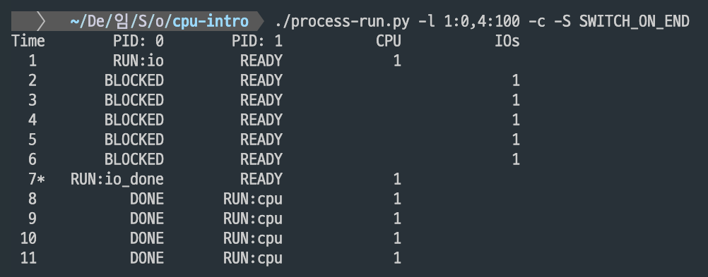

𝐐5. 이번에는 프로세스가 입출력을 기다릴 때마다 다른 프로세스로 전환하도록 플래그를 지정하여 같은 프로세스를 실행시켜 보자 (-l 1:0,4:100 -c -S SWITCH_ON_IO) 이제 어떤 결과가 발생하는가? -c를 사용하여 예측이 맞는지 확인하시오.  

𝐀5. io 발생 시마다 다른 프로세스로 전환시키면 io 대기(BLOCKED) 중에 CPU 작업이 실행되어 3번 상황과 같이 7tick이 소요된다. 
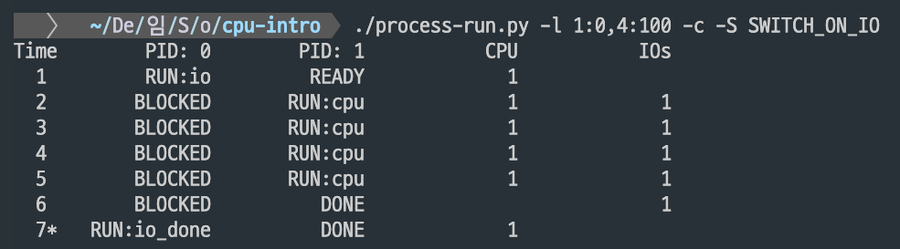

𝐐6. 또 다른 중요한 행동은 입출력이 완료되었을 때 무엇을 하느냐이다. -I IO_RUN_LATER 가 지정되면 입출력이 완료되었을 때 입출력을 요청한 프로세스가 바로 실행될 필요가 없다. 완료 시점에 실행 중이던 프로세스가 계속 실행된다. 다음과 같은 조합의 프로세스를 실행시키면 무슨 결과가 나오는가? (./process-run.py -l 3:0,5:100,5:100,5:100 -S SWITCH_ON_IO -I IO_RUN_LATER -c -p) 시스템 자원은 효과적으로 활용되는가?  
 
𝐀6. 먼저 io 명령어가 실행된 후 cpu 작업 명령어가 실행된다. 이 때 io 완료 명령은 지연된다. 따라서 3개의 cpu 명령이 끝난 후 첫 번째 io 입력 종료가 된 후 나머지 io 명령 2개가 실행된다. io가 완료되어도 현재 실행 중인 cpu 작업이 계속 우선권을 가져가서 io 프로세스의 다음 작업이 지연되기 때문이다. 이렇게 시스템 자원은 비효율적으로 활용된다.
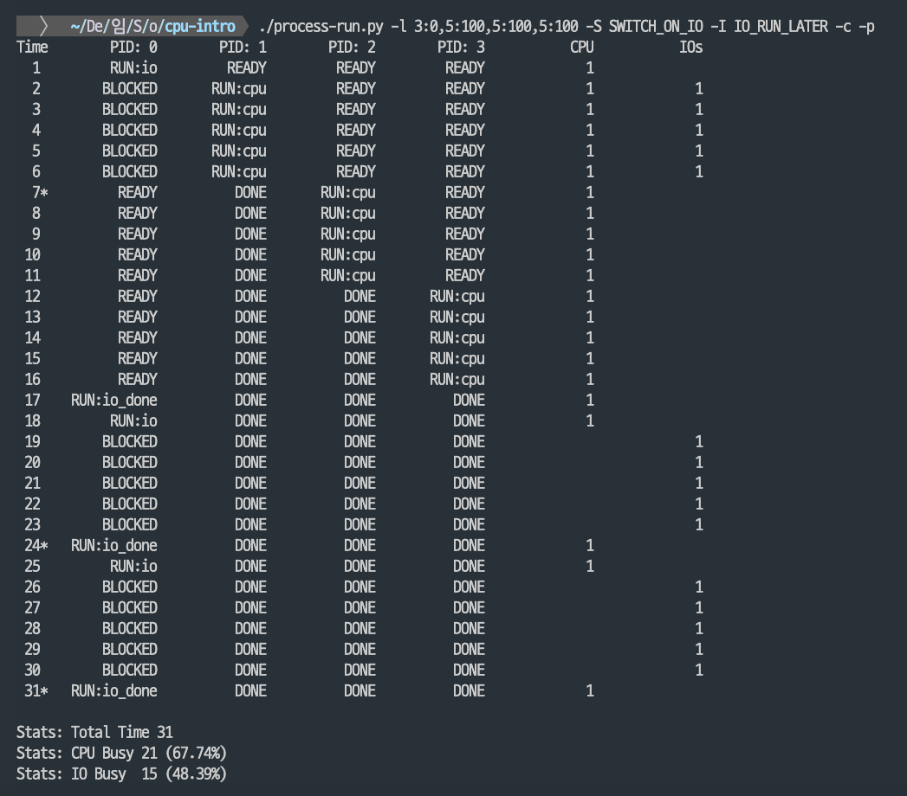

𝐐7. 6과 같은 프로세스 조합을 실행시킬 때 -I IO_RUN_IMMEDIATE를 지정하고 실행시키시오. 이 플래그는 입출력이 완료되었을 때 요청 프로세스가 곧바로 실행되는 동작을 의미한다. 이 동작은 어떤 결과를 만들어 내는가? 이 명령이 효율적일 수 있는 이유는 무엇인가?  

𝐀7. 이 경우에는 io 입력 완료가 제시점에 된다. io 완료 이후 다시 io 시작하고, io 대기할 때마다 cpu 작업을 병렬처리할 수 있게 된다.
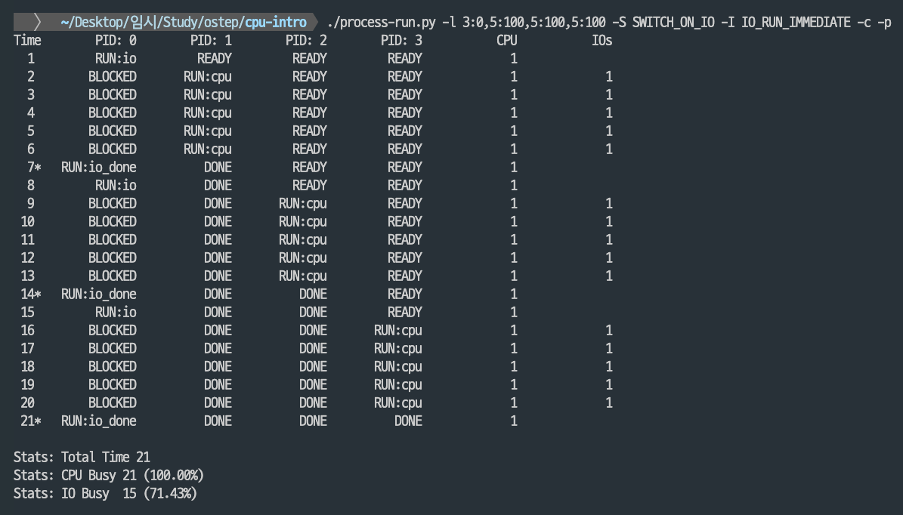

𝐐8. 이제 다음과 같이 무작위로 생성된 프로세스를 실행시켜 보자. 예를 들면, -s 1 -l 3:50,3:50, -s 2-l 3:50,3:50, -s 3 -l 3:50,3:50 에 대해서 -I IO_RUN_IMMEDIATE를 지정했을 때와 -I IO_RUN_LATER를 지정했을 때, -S SWITCH_ON_IO를 지정했을 때와 -S SWITCH_ON_END를 지정했을 때 어떤 양상을 보일지 예측해보시오.  

𝐀8. io 완료 시 다음 명령어 바로 실행하는 IO_RUN_IMMEDIATE와 io 대기 시마다 문맥전환하는 SWITCH_ON_IO 조합이 가장 효율적이다. 특히 io 작업이 많은 seed2(cpu: 33.33% -> , 62.50%, io: 66.67% -> 87.50% 개선), seed3(cpu: 37.50% -> 52.94%, io: 62.50%->64.71% 개선)에서 그 차이가 더 두드러졌다. 참고로 SWITCH_ON_IO 옵션을 사용할 때는 현재 실행 중인 프로세스가 cpu를 양보할 때까지 기다려야 하므로 IO_RUN_LATER와 IO_RUN_IMMEDIATE에 대한 유의미한 차이는 없었다. 
<table align="center">
  <tr>
    <th colspan="2" align="center">IO_RUN</th>
    <th colspan="2" align="center">SWITCH_ON</th>
  </tr>
  <tr>
    <th align="center">LATER</th>
    <th align="center">IMMEDIATE</th>
    <th align="center">END</th>
    <th align="center">IO</th>
  </tr>
  <tr>
    <td align="center">입출력 완료 시에도 다음 명령어 실행 X → 응답 지연</td>
    <td align="center">입출력 완료 시 다음 명령어 바로 실행</td>
    <td align="center">요청 프로세스 종료 시에 문맥 전환 → CPU 유휴 시간 발생</td>
    <td align="center">입출력 대기 시마다 문맥 전환</td>
  </tr>
</table>

seed1.

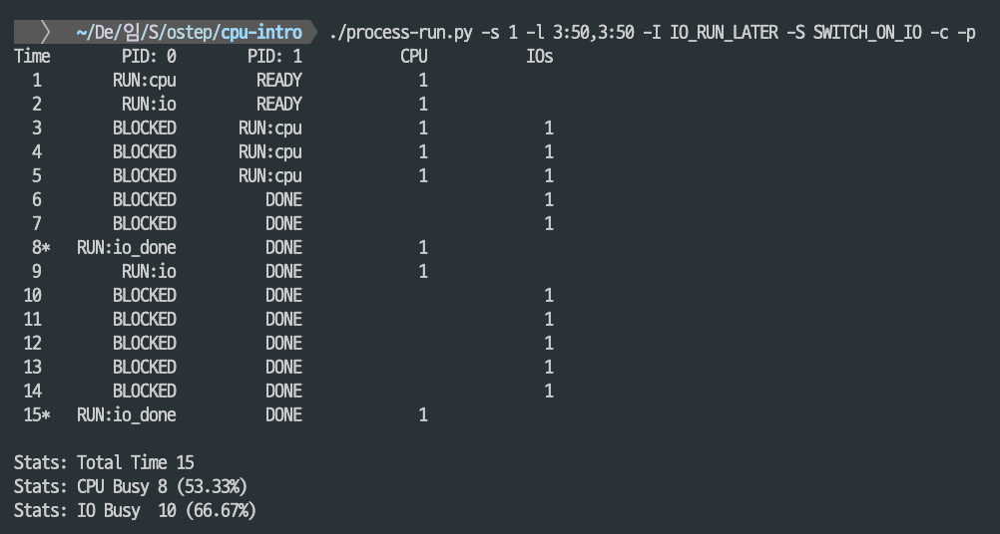
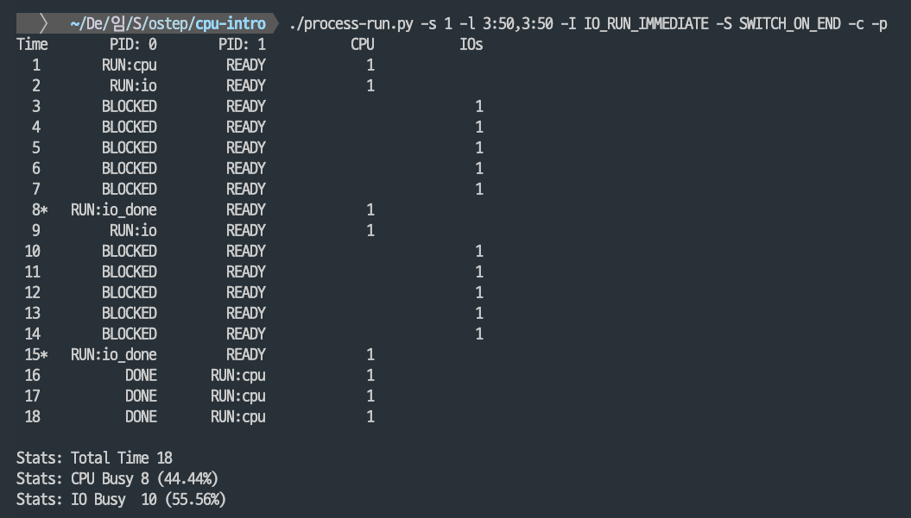
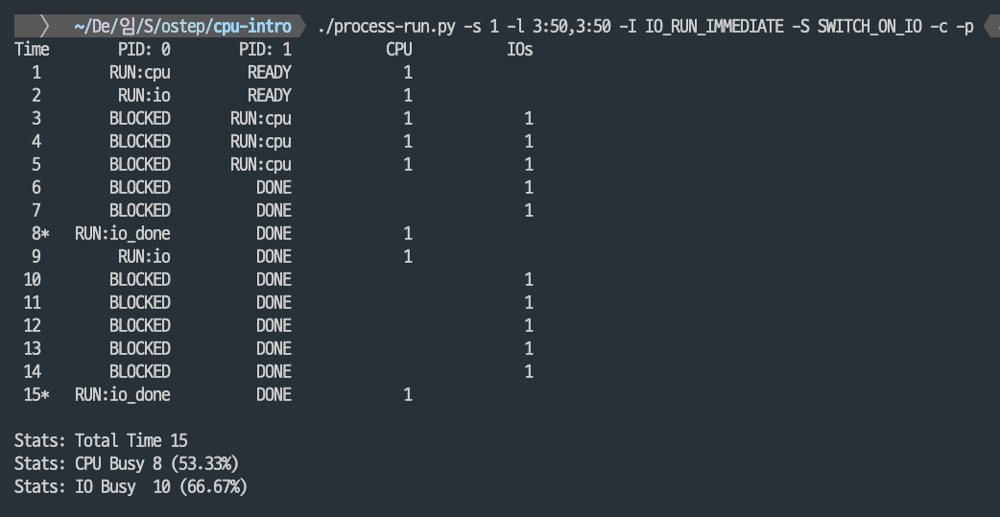
seed2.
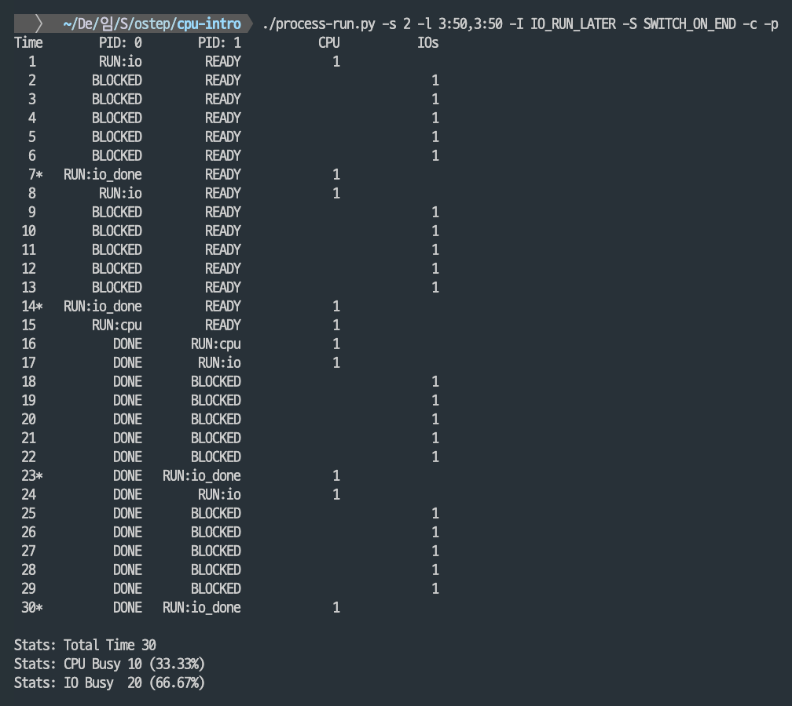
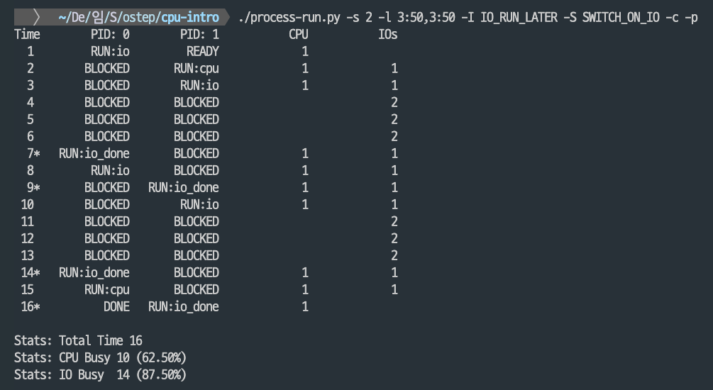
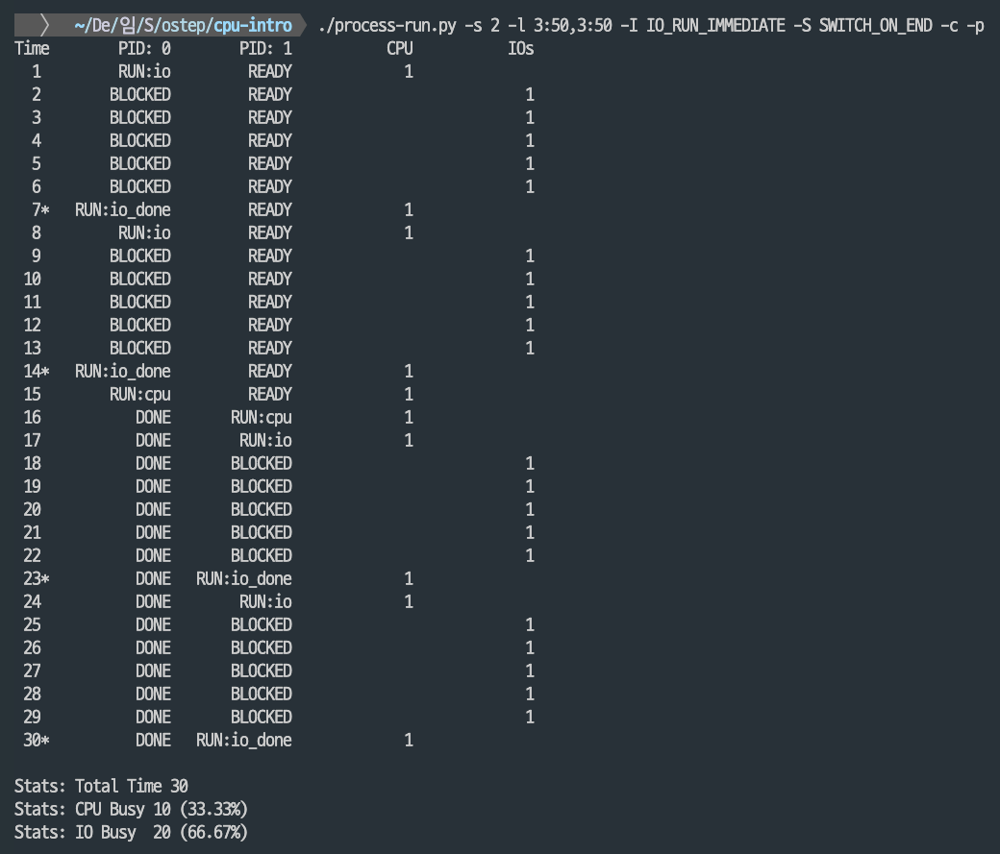
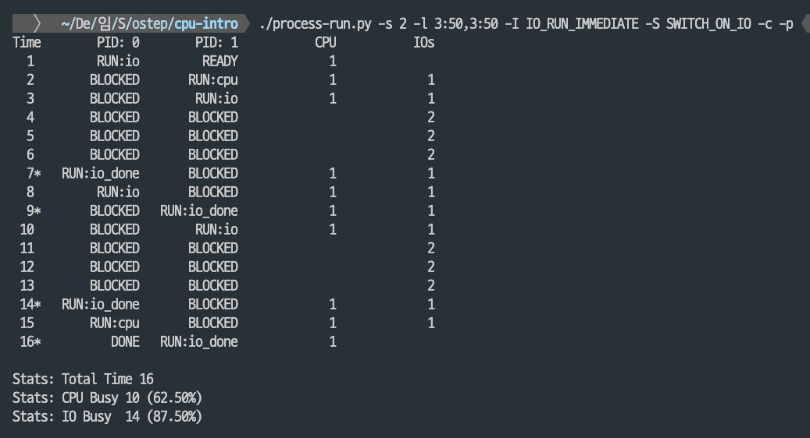
seed3.
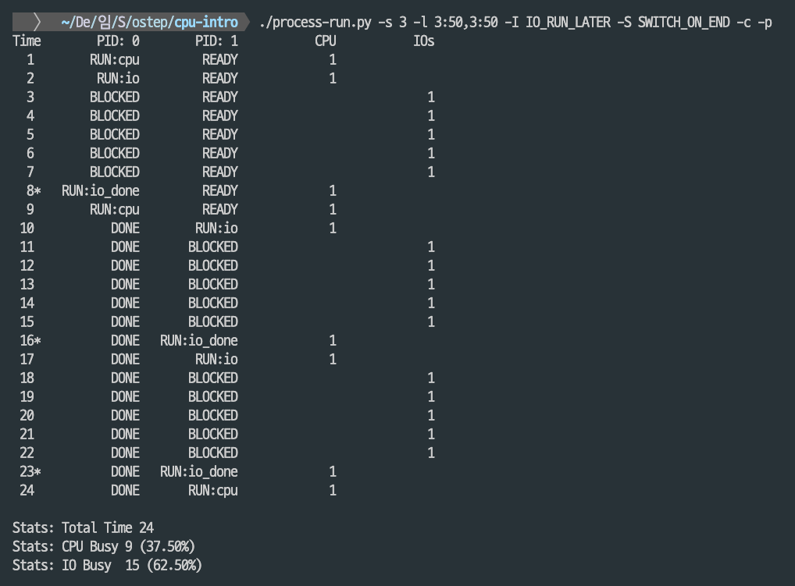
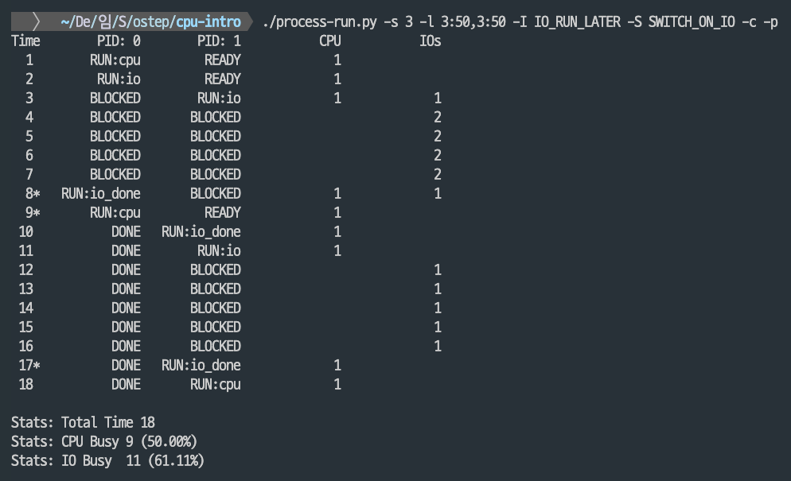
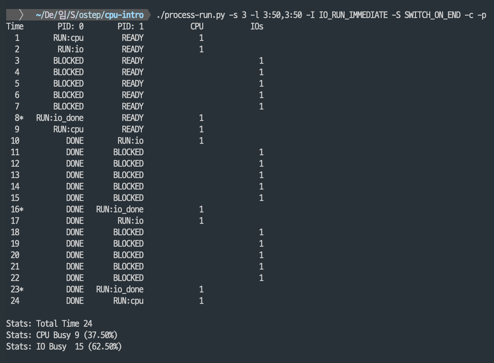
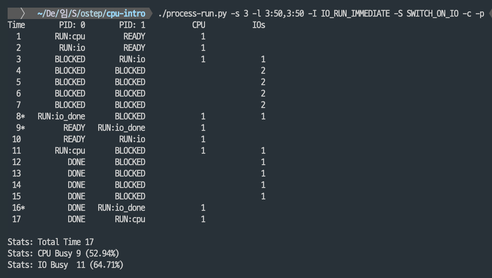

## 프로세스의 API
 - 생성 (예: fork(), exec())
 - 제거 (예: exit())
 - 대기 (예: wait())
 - 각종 제어 (예: kill(), signal(), suspend(), resume())
 - 상태 (예: ps(), getpid(), getppid(), proc filesystem)  
 ---
* fork(): 자식 프로세스 생성할 때 호출
    * fork()로 생성된 프로세스가 자식, fork()를 호출한 프로세스의 부모 
    * 자식 프로세스는 부모 프로세스의 복사본이지만 자신만의 주소공간, 레지스터, PC값을 가짐
    * 부모 프로세스가 받는 fork()의 반환값은 자식 프로세스의 PID, 자식 프로세스가 받는 fork()의 반환값은 0
    * UNIX 시스템에서는 fork 시스템 콜을 사용해서 새로운 프로세스를 생성함
* wait(): 부모 프로세스가 자식 프로세스의 종료를 대기할 때 호출
* exec(): 자기 자신이 아닌 다른 프로세스를 실행해야 할 때 호출

## 제한적 직접 실행 원리(Limited Direct Execution)
운영체제는 하드웨어의 지원(모드 비트, trap, 타이머 인터럽트)을 받아 **제한적 직접 실행**이라는 기법을 사용해 CPU 가상화를 구현. 프로그램을 CPU에서 직접 실행시키되, 운영체제가 CPU 제어권을 잃지 않도록 프로세스의 행동에 제한을 두는 방식. 이를 통해 다중 프로세스가 안전하게 실행될 수 있음

### 기본 원리
1. 프로세스를 위한 메모리를 할당하고 프로그램을 메모리에 적재
2. CPU를 **사용자 모드(user mode)**<wbr>로 전환하고 프로그램의 `main()`으로 이동
3. 프로그램 실행 중 **시스템 콜** 발생 시 → **커널 모드(kernel mode)**<wbr>로 전환 후 운영체제가 처리
4. 요청 처리 완료 후 다시 사용자 모드로 돌아가 프로그램 실행 계속

### 문제점 1. 제한된 연산
- 프로세스가 모든 연산을 수행하면 보안/안정성 문제 발생
- 사용자 모드에서는 특정 연산이 제한됨
- 제한된 연산은 **시스템 콜**을 통해 운영체제에게 요청해야 함

**핵심 질문:** 프로세스가 제한된 연산을 어떻게 수행하는가?  
→ 하드웨어와 운영체제의 협력으로 가능

#### 하드웨어의 지원: 보호된 제어 양도
CPU는 두 가지 실행 모드 제공
- **사용자 모드(User mode)**: 응용 프로그램 실행, 자원 접근 제한
- **커널 모드(Kernel mode)**: 운영체제 실행, 모든 자원 접근 가능

#### 특수 명령어
- `trap`: 사용자 모드 → 커널 모드 전환
- `return-from-trap`: 커널 모드 → 사용자 모드 복귀
---
운영체제는 **트랩 테이블(trap table)**<wbr>을 등록하여, 트랩 발생 시 어떤 코드를 실행할지 하드웨어에 알려줌
- 시스템 콜은 일반 함수 호출처럼 보이지만 내부에 **`trap` 명령어**가 숨어 있음
- 예: `open()` 시스템 콜 실행 과정
  1. C 라이브러리의 `open()` 함수 호출
  2. 인자와 시스템 콜 번호를 정해진 위치(스택/레지스터)에 저장
  3. `trap` 실행 → 커널 모드 전환
  4. 운영체제가 요청 처리 후 결과를 저장
  5. `return-from-trap`으로 사용자 모드 복귀, 결과 반환

> 시스템 콜 구현부는 하드웨어 의존성이 크므로 **어셈블리어**로 작성되어있지만 개발자는 단순히 `open()`, `read()` 같은 함수를 호출하기만 하면 됨.

### 문제점 2: 프로세스 간 전환

운영체제는 CPU를 여러 프로세스에 분배해야 함 → **시분할(time sharing)** 필요.  
이를 위해 운영체제는 **타이머 인터럽트**를 활용.

#### 협조적 스케줄링 (Cooperative Scheduling)
- 초기 운영체제에서 사용
- 프로세스가 스스로 CPU를 양보해야 함
- 파일 I/O, 네트워크, `yield()` 같은 시스템 콜 호출 시 자연스럽게 CPU 제어권이 운영체제로 돌아감
- 문제: 무한 루프에 빠진 프로세스가 있으면 운영체제가 통제 불가
> 리부팅의 유용성 
> 협조적 방식에서 문제가 발생하면 **재부팅**이 유일한 해결책이었으며, 재부팅은 단순하면서도 유용한 방법 
> * 대규모 인터넷 서비스에서는 일부 서버를 주기적으로 재부팅하는 것이 일반적인 관리 방식임.

#### 비협조적 스케줄링 (Preemptive Scheduling)
- 운영체제가 강제로 CPU 제어권을 획득
- **타이머 인터럽트** 활용
  - 일정 시간마다 인터럽트 발생
  - 운영체제의 인터럽트 핸들러 실행
  - CPU 제어권을 되찾아 문맥 교환 수행 가능

#### 문맥 교환 (Context Switch)
- 현재 프로세스 상태(레지스터, PC 등)를 PCB(Process Control Block)에 저장
- 다음 실행할 프로세스의 상태를 복원
- `return-from-trap` 실행 시 새 프로세스가 이어서 실행됨

#### 문맥 저장 시점
1. **하드웨어**: 인터럽트 발생 시 사용자 레지스터를 커널 스택에 저장
2. **운영체제**: 스케줄러가 전환 결정 시 나머지 레지스터를 PCB에 저장

#### 병행성 이슈

- 인터럽트 처리 중 다른 인터럽트가 발생하면 문제 발생
- 해결 방법:
  - 인터럽트 처리 중에는 추가 인터럽트 차단
  - 커널 내부 자료구조 보호를 위해 **락(lock)** 기법 사용
