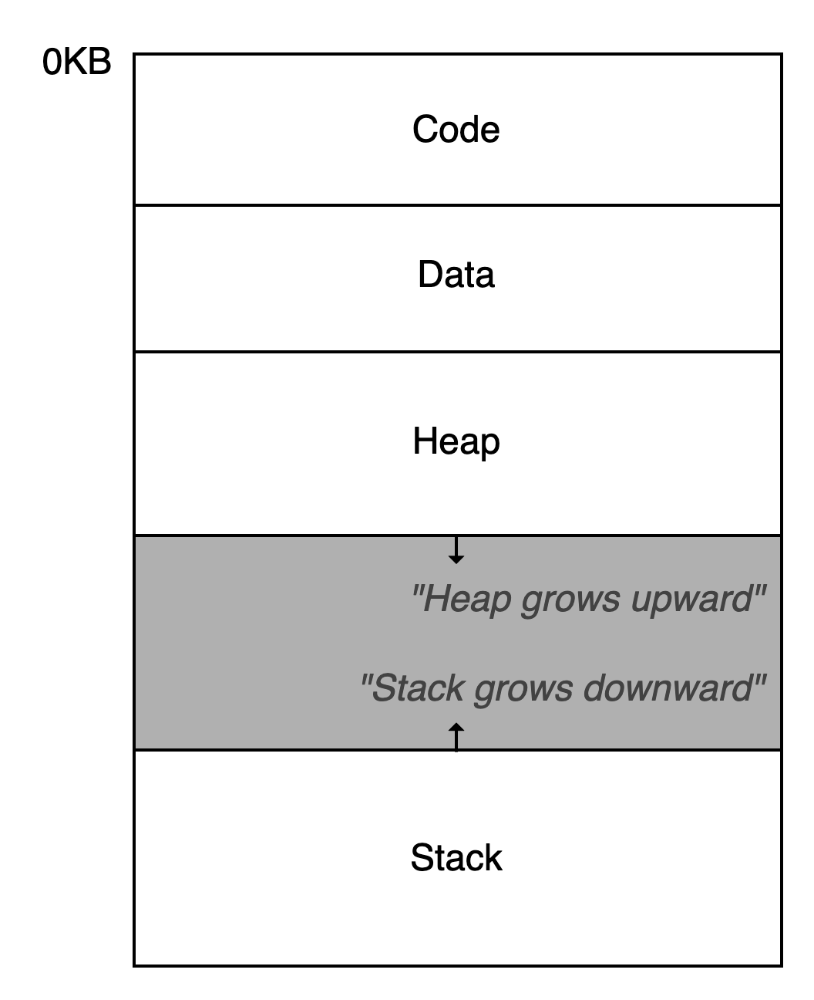
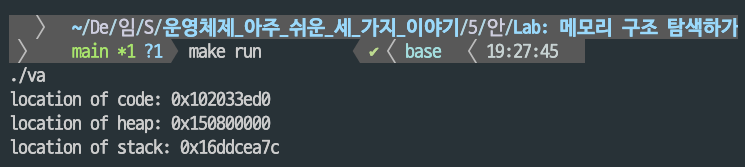

## 주소 공간의 개념
* 논리 주소: 프로그램이 직접 다루는 가상의 메모리 주소. 프로세스별로 자신만의 독립적인 논리주소를 가짐
* 물리 주소: 실제 메모리 하드웨어 주소. 논리 -> 물리 주소로 변환되어 실제 메모리에 데이터가 저장됨

### 시분할 시스템의 등장
* 초기 컴퓨터 시스템은 단일 프로세스로 구동되었지만, 효율적인 컴퓨터 자원 사용이 요구되면서 멀티 프로그래밍이 등장
* 초기(1950~60년대 초반)에는 **`일괄 처리(Batch Processing)`** 방식으로 CPU 활용률을 높였지만 사용자는 즉시 응답을 받을 수 없었음
* 이후(1960년대 중반~) MIT의 CTSS나 이후 MULTICS같은 프로젝트에서 여러 사용자가 하나의 메인 프레임에 동시에 접속하는 **`시분할(Time Sharing)`** 개념이 도입되면서 1960년대 후반부터 '코드 입력 -> 바로 실행 결과 확인 -> 수정'이 가능한 **`대화형 프로그래밍`**<wbr>이 표준 개발 방식으로 자리잡음
* 초기 시분할 시스템에서는 프로세스 실행 순간 **메모리 전체**에 접근 권한을 부여해 프로세스를 중단하고 그때의 모든 상태를 디스크에 저장한 뒤 다른 프로세스의 정보를 메모리로 불러와 잠깐 실행하는 식이었음
    * 이 방식은 CPU는 수 밀리초 단위로 문맥 교환이 가능한 반면, 디스크 I/O는 수백 밀리초~수 초가 소요되어 시분할의 장점이 상쇄됨
    * 따라서 메모리에 저장된 데이터를 디스크에 옮기지 않고도 프로세스를 교체할 수 있는 방법이 초기 시분할 시스템 효율화의 목표가 됨 
* **`메모리 보호 기법`**<wbr>과 **`가상 메모리`**<wbr>로 위의 문제를 해결!
    * 각 프로세스는 실제 물리 메모리의 일부만 사용하면서 문맥 교환 시 메모리 전체를 옮길 필요 없이 레지스터 값만 교체함으로써 메모리를 보호함
    * 프로세스는 자신만의 전용 가상 주소 공간을 갖고 실제 물리 메모리는 여러 프로세스가 나눠 씀 -> 필요한 페이지만 메모리에 두고, 나머지는 디스크에 둔 채 필요할 때 페이지 폴트로 불러옴 -> 덕분에 메모리에 계속 남아있는 데이터는 그대로 두고, 레지스터와 일부 메타데이터만 바꾸면 문맥 전환이 가능해짐 + 디스크는 메모리에서 밀려난 페이지를 보관하는 보조 역할로만 사용

### 주소 공간
* **Code**
    * CPU가 실행 가능한 기계어 코드 저장
    * 읽기 전용으로 보호
* **Data**
    * **'초기화된'** 전역 변수나 정적 변수 등 프로그램에서 사용하는 데이터 저장
    * 프로그램 시작 시 할당, 종료 시 해제
    * cf. 초기화되지 않은 전역변수와 정적 변수는 BSS 영역에 0이나 NULL로 초기화되어 저장 
* **Heap**
    * 프로그램 실행 중 동적으로 크기가 결정되는 데이터 저장
    * 주로 객체와 같은 참조형 데이터 저장
    * 메모리의 낮은 주소 -> 높은 주소 방향으로 할당
* **Stack**
    * 함수 호출 시 전달되는 인자, 반환 주소, 지역 변수 등이 임시로 저장
    * 함수 호출 시 할당, 함수 종료 시 해제
    * 메모리의 높은 주소 -> 낮은 주소 방향으로 할당


* 레지스터는 현재 실행 중 필요한 주소 값(=가상 주소)만 잠시 보관
* 전체 가상 주소 공간은 운영체제 + MMU + 페이지 테이블이 관리
    * `레지스터`: 가상 주소 값 저장 (예: 0x00401000)
    * `MMU`: 레지스터에서 나온 가상 주소 → 페이지 테이블 참조 → 물리 주소 변환
    * 메모리 접근: 변환된 물리 주소로 실제 RAM 접근

### 가상 메모리 시스템의 목표
1. **투명성(Transparency)**
    * 사용자와 응용 프로그램이 복잡한 물리메모리를 직접 다루지 않게 함
2. **효율성(Efficiency)**
    * 운영체제가 가상 주소 -> 실제 물리 주소로 변환하는 과정에서 발생하는 오버헤드를 최소화해야 함 -> 따라서 `페이지 테이블`이나 `TLB`와 같은 하드웨어 지원 메커니즘이 필수!
3. **보호(Protection)**
    * 가상 메모리 시스템은 각 페이지나 세그먼트 별로 읽기, 쓰기, 실행 권한 설정 -> 프로세스가 자신의 가상 주소 내에서만 메모리에 접근할 수 있게 만듦 

## 메모리 관리 API
### 메모리 공간의 종류
C 프로그램 실행 시 `스택`과 `힙` 메모리 공간이 할당됨
* 스택 메모리는 컴파일러가 자동으로 할당과 해제를 관리해줌
* 힙 메모리는 프로그래머가 직접 할당과 해제에 대한 관리를 해야 함

#### malloc()
* 힙에서 메모리를 동적으로 할당
* 필요한 메모리의 바이트 단위 크기를 인자로 전달
* 할당 성공 시 새로 할당된 메모리 블록의 시작 주소를 가리키는 포인터(**`void*`**) 반환, 실패시 NULL 반환
    * malloc()은 그저 메모리 블록의 주소만 반환할 뿐, 해당 공간에 어떤 타입의 데이터를 저장할지는 전적으로 프로그래머에게 맡김. 따라서 아래 코드에서 (int*)로 타입캐스팅한 것과 같이 타입을 명시해서 의도를 분명히 하는 것이 좋음
    ```
    void func() {
        int *x = (int*) malloc(sizeof(int));
        // ...
    }
    ```

#### free()
* free()는 인자로 malloc()이 반환한 포인터 값 하나만 받음
* 메모리 할당 라이브러리가 내부적으로 해제할 메모리 블록의 크기를 관리하고 있기 떄문
```
int *x = malloc(10 * sizeof(int));
// ...
free(x);
```

#### 운영체제의 지원
* malloc()과 free()는 각각 메모리 할당과 해제를 담당하는 라이브러리 함수인 반면, 라이브러리 자체는 운영체제에게 메모리를 요청하고 반환하는 시스템 콜을 기반으로 동작함 
* 중요한 점은 프로그래머가 직접 시스템콜을 호출하면 안 되고 malloc()이나 free()같은 메모리 할당 라이브러리 내부에서만 사용되어야 함
* 운영체제에게 메모리를 요청하고 반환하는 시스템 콜
    * **`bkr`**
        * 프로그램의 새로운 브레이크(힙의 끝) 주소 값을 인자로 받아서 힙의 크기를 늘리거나 줄임
    * **`sbkr`**
        * brk와 비슷한 역할을 하는데 브레이크 위치를 얼마나 옮길지 그 증감량을 인자로 받음
* **`mmap()`**<wbr>을 직접 사용해서 운영체제로부터 파일과 연결되지 않은 익명(anonymous) 메모리 영역을 받아올 수도 있음


#### 기타 함수들
* calloc()
    * malloc()과 비슷하지만 할당된 메모리 블록을 모두 0으로 초기화한 뒤 반환
    * '초기화되지 않은 읽기'와 같은 미묘한 버그를 예방하는 데 도움이 됨 
* realloc()
    * 이미 malloc()이나 calloc()으로 할당한 메모리 블록의 크기를 조정할 때 사용
    * 기존 블록보다 큰 새 메모리 블록을 할당하고, 이전 블록의 내용을 모두 복사해온 뒤, 새 블록의 주소를 반환


## 🧪Lab: 메모리 구조 탐색하기
* main 함수의 주소를 사용해 코드 영역의 위치 출력
* malloc을 사용해서 1억바이트 할당하고 힙의 위치 출력
* 정수 변수 x를 선언하고 x의 주소를 사용해서 스택의 위치 출력
