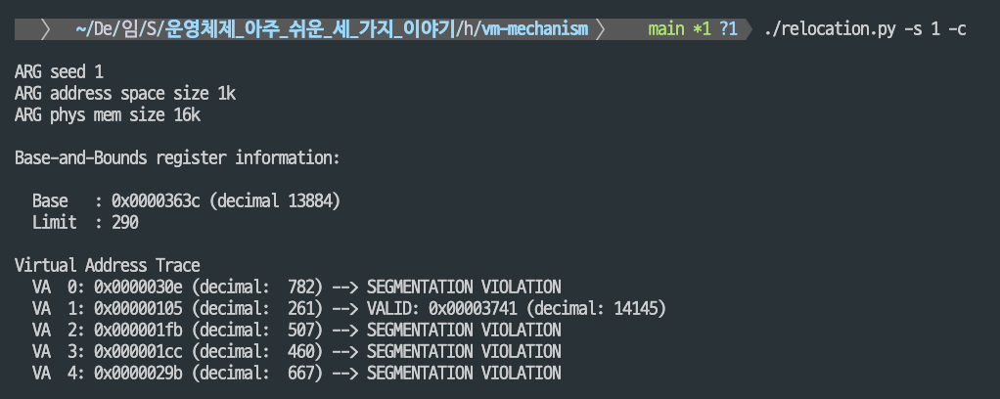
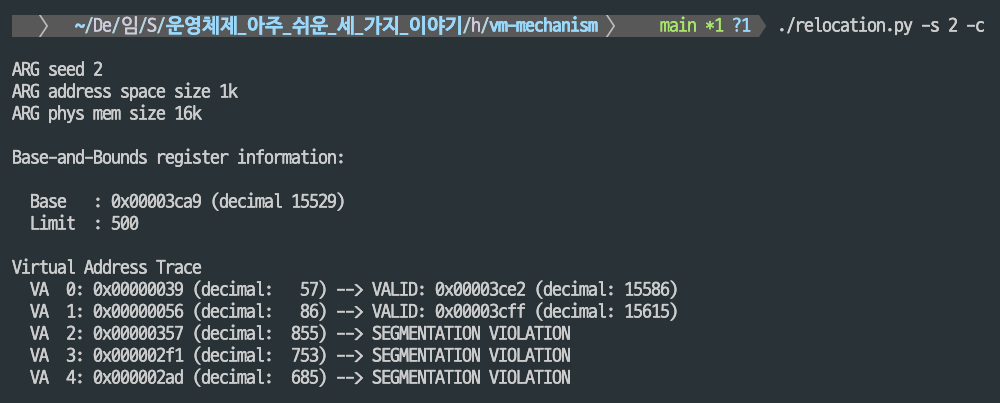
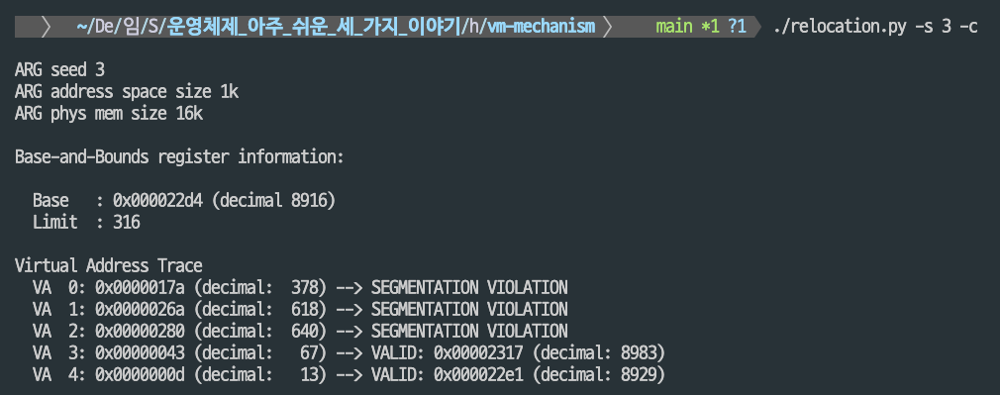
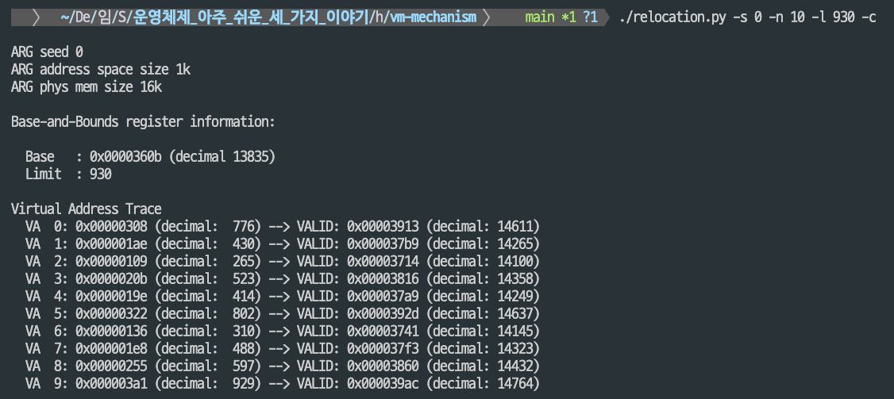
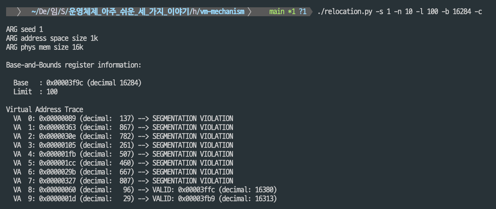
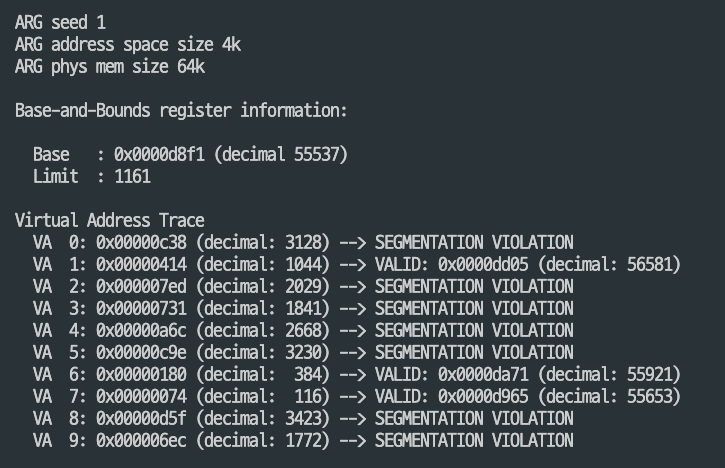
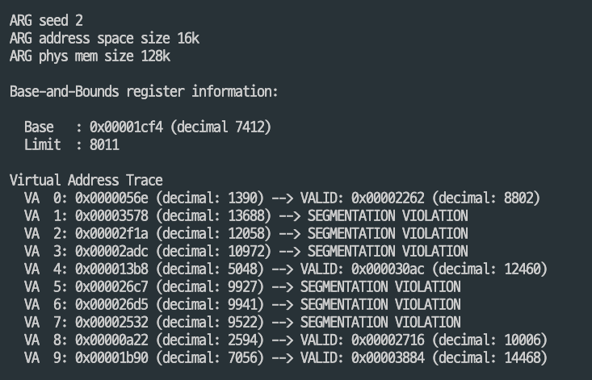

## 주소 변환의 원리
1. 메모리 가상화의 3대 목표
    * 효율성
        - 하드웨어 지원 (레지스터, TLB)으로 빠른 주소 변환
        - 소프트웨어 오버헤드 최소화
    * 제어
        - 프로세스 간 메모리 격리
        - 무단 접근 방지로 보안 강화
    * 유연성
        - 물리 메모리에 대한 제약 없는 프로그래밍 환경
        - 독립적인 주소 공간 제공

2. 주소 변환
    * 물리 주소 = 베이스 + 가상 주소 (단, 가상 주소 < 바운드 레지스터)
    * 핵심 메커니즘
        - 가상 주소 → 물리 주소 매핑
        - MMU가 자동 처리

3. 동적 재배치
    - 각 프로세스마다 고유한 값을 가짐
    - 문맥 교환 시 PCB(프로세스 메타데이터 저장 구조)에서 로드/저장
    - 베이스 레지스토와 바운드 레지스터 이용
        * 베이스 레지스터 (Base Register)
            - 역할: 프로세스의 물리 메모리 **시작 주소** 저장
            - 기능: 가상 주소에 더해져 물리 주소 계산
            - 장점: 레지스터 값을 변경함으로써 메모리의 어디든지 프로세스 배치 가능 (위치 독립성)
        * 바운드 레지스터 (Bound Register)
            - 역할: 주소 공간 크기 또는 물리 메모리 **마지막 주소** 저장
            - 기능: 메모리 접근 범위 검증
            - 장점: 범위 초과 시 예외 발생으로 보호
    - 장점
        - 간단하고 효율적인 구현
        - 하드웨어 지원으로 빠른 처리
        - 프로세스 간 메모리 보호
        - 위치 독립성 제공
    - 단점
        - 내부 단편화: 사용하지 않는 주소 공간도 물리 메모리 차지
        - 유연성 부족: 코드/스택/힙 분리 불가
        - 연속 메모리 필요: 큰 프로세스 배치 어려움
        - 크기 제한: 물리 메모리보다 큰 프로세스 실행 불가

4. 운영체제의 역할
    * 프로세스 생성 시
        - 물리 메모리에서 빈 슬롯 찾기
        - 베이스/바운드 레지스터 설정
        - PCB에 정보 저장
    * 프로세스 종료 시
        - 메모리 영역 회수
    * 문맥 교환 시
        - 현재 프로세스의 베이스/바운드 값 저장
        - 새 프로세스의 값을 CPU 레지스터에 로드
    * 메모리 보호 규칙 위반 시
        - 예외 핸들러 실행
        - 프로세스 종료 또는 적절한 조치

5. 현대 시스템으로의 발전
베이스-바운드는 가상 메모리의 시작점이며, 현대 시스템은 다음 기술로 발전했지만, 베이스-바운드의 핵심 개념(하드웨어 주소 변환, 메모리 보호)은 여전히 모든 현대 메모리 관리의 기초임!

    - 세그멘테이션: 코드/데이터/스택 분리 관리
    - 페이징: 비연속 메모리 할당, 외부 단편화 해결
    - TLB: 주소 변환 캐싱으로 성능 향상
    - 다단계 페이지 테이블: 메모리 효율 개선


---
## 세그멘테이션(Segmentation)
1. 필요성
    * 동적 재배치 방식의 문제점
        - 스택과 힙 사이의 사용되지 않는 큰 공간이 물리 메모리를 차지
        - 내부 단편화로 인한 메모리 낭비
        - 4GB 주소 공간 중 수 MB만 사용해도 전체가 메모리에 탑재되어야 함
    * 동적 재배치의 한계에 대한 세그멘테이션의 해결책
        - 주소 공간을 논리적 단위(코드, 스택, 힙)로 분할
        - 각 세그멘트마다 별도의 베이스-바운드 쌍 할당
        - 사용 중인 메모리에만 물리 공간 할당

2. 핵심 개념
    - 프로그램의 논리적 구성 요소 (코드, 데이터, 스택, 힙 등)
    - 연속적인 주소 공간을 차지
    - 고유한 크기와 보호 속성을 가짐

3. 주소 변환 과정 


*현대 시스템(x86-64)에서는 플랫 메모리 모델 사용으로 논리 주소 ≈ 선형 주소*

* 주소 변환 공식
```
1. 가상 주소의 상위 비트로 세그먼트 식별
2. 세그먼트 내 오프셋 = 가상주소 - 세그먼트 시작주소
3. 물리 주소 = Base + 오프셋
4. 범위 검사: 오프셋 < Limit
```
* 주소 변환 예제
```
가상 주소 4200 (힙)
힙 시작: 4096 (4KB)
오프셋: 4200 - 4096 = 104
물리 주소: 34KB + 104 = 34920
```

4. 하드웨어 지원 요소
* 세그먼트 레지스터
```
세그먼트   Base    Limit   방향비트   보호비트
코드       32KB    2KB     양(1)      읽기/실행
힙         34KB    2KB     양(1)      읽기/쓰기
스택       28KB    2KB     음(0)      읽기/쓰기
```

* 세그먼트 식별 방법
    * **명시적 방법**
        - 가상 주소의 최상위 비트 사용
        - 예: 2비트 사용 시 4개 세그먼트 구분 가능
        ```
        00(2진수) = 1(10진수) → 코드 세그먼트
        01(2진수) = 2(10진수) → 힙 세그먼트
        10(2진수) = 3(10진수) → (미사용)
        11(2진수) = 4(10진수) → 스택 세그먼트
        ```
    * **묵시적 방법**
        - 주소 생성 방식으로 판단
        - PC(Program Counter) → 코드 세그먼트
        - SP(Stack Pointer) → 스택 세그먼트
        - 기타 → 힙 세그먼트
* 방향 비트
    - **양의 방향(1)**: 코드, 힙 - 낮은 주소에서 높은 주소로 증가
    - **음의 방향(0)**: 스택 - 높은 주소에서 낮은 주소로 증가

* 보호 비트
    - **읽기(R)**: 읽기 가능
    - **쓰기(W)**: 쓰기 가능
    - **실행(X)**: 실행 가능
    - 예: 코드 세그먼트는 R-X (읽기/실행만 가능)

5. 세그멘테이션의 장점
    * 메모리 효율성
        - 사용 중인 영역만 물리 메모리 할당
        - 드문드문 사용되는 주소 공간(sparse address space) 지원
        - 스택-힙 사이 빈 공간 낭비 방지
    * 코드 공유
        - 여러 프로세스가 읽기 전용 코드 세그먼트 공유
        - 메모리 절약 + 독립성 유지
    * 메모리 보호
        - 세그먼트 단위 접근 권한 제어
        - 범위 초과 시 하드웨어 예외 발생 (세그멘테이션 폴트)
    * 빠른 주소 변환
        - 간단한 산술 연산 (Base + Offset)
        - 하드웨어 구현 용이

6. 세그멘테이션의 단점
    * 외부 단편화 (External Fragmentation)
        ```
        상황: 물리 메모리에 작은 빈 공간들이 산재
        [프로세스A][빈공간][프로세스B][빈공간][프로세스C][빈공간]
        → 총 24KB 빈 공간 존재하지만 연속되지 않아 20KB 할당 불가
        ```
        **해결 방법**
        1. **압축(Compaction)**: 세그먼트를 이동시켜 빈 공간 통합
            - 장점: 외부 단편화 해소
            - 단점: 높은 오버헤드, 프로세서 시간 소모

        2. **빈 공간 관리 알고리즘:**
            - **최초 적합(First-fit)**: 첫 번째로 충분한 공간 할당
            - **최적 적합(Best-fit)**: 가장 비슷한 크기의 공간 할당
            - **최악 적합(Worst-fit)**: 가장 큰 공간 할당
            - **버디 알고리즘(Buddy)**: 2의 제곱 크기로 분할/병합

    * 제한된 유연성
        - 큰 힙이 하나의 세그먼트에 있으면 전체가 메모리에 존재해야 함
        - 세그먼트 내부의 불연속 사용은 지원 불가

7. 운영체제의 역할
    * 문맥 교환 시
        - 모든 세그먼트 레지스터 저장
        - 새 프로세스의 레지스터 복원
    * 메모리 관리
        - 빈 공간 리스트 유지
        - 새 세그먼트 할당 시 적절한 위치 찾기
        - 필요 시 메모리 압축 수행

8. 실제 시스템 적용 사례
    * 과거 시스템
        - **VAX/VMS**: 명시적 세그멘테이션 (최상위 비트 사용)
        - **Intel x86**: 세그먼트 선택자 + 페이징 혼합
        - **Multics**: 소단위 세그멘테이션
    * 현대 시스템
        - **대부분의 OS**: 페이징 중심 + 일부 세그먼테이션 개념
        - **임베디드**: MPU(Memory Protection Unit)에서 세그멘테이션 개념 사용
        - **x86-64**: 세그멘테이션 기능 축소, 플랫 메모리 모델


#### 📖 과제
1. 시드 1, 2, 3으로 주소 변환 계산
* **Seed 1**
```bash
python3 relocation.py -s 1
```

* **Base-and-Bounds 정보**
- Base: 0x0000363c (decimal 13884)
- Limit: 290

**가상 주소 변환 결과:**


* 분석
    - Limit가 290이므로 가상 주소가 290 미만일 때만 유효
    - 5개 주소 중 1개(20%)만 유효한 주소
    - 유효한 주소: Base(13884) + VA(261) = PA(14145)

* **Seed 2**
```bash
python3 relocation.py -s 2
```

**Base-and-Bounds 정보:**
- Base: 0x00003ca9 (decimal 15529)
- Limit: 500

**가상 주소 변환 결과:**


**분석:**
- Limit가 500이므로 가상 주소가 500 미만일 때만 유효
- 5개 주소 중 2개(40%)가 유효한 주소
- Limit가 클수록 유효한 주소 비율 증가

* **Seed 3**
```bash
python3 relocation.py -s 3
```

**Base-and-Bounds 정보:**
- Base: 0x000022d4 (decimal 8916)
- Limit: 316

**가상 주소 변환 결과:**


**분석:**
- Limit가 316이므로 가상 주소가 316 미만일 때만 유효
- 5개 주소 중 2개(40%)가 유효한 주소
- 작은 가상 주소(13, 67)만 범위 내에 있음

2. 모든 가상 주소가 범위 내에 있도록 하는 최소 Limit 값
```bash
python3 relocation.py -s 0 -n 10
```

**생성된 가상 주소 (10진수):**
- VA 0: 430
- VA 1: 265
- VA 2: 523
- VA 3: 414
- VA 4: 802
- VA 5: 310
- VA 6: 488
- VA 7: 597
- VA 8: 929 ← **최대값**
- VA 9: 516

**답: Limit = 930**

**검증:**
```bash
python3 relocation.py -s 0 -n 10 -l 930 -c
```


3. 주소 공간이 물리 메모리에 완전히 들어가는 최대 Base 값

```bash
python3 relocation.py -s 1 -n 10 -l 100
```

**주어진 조건:**
- Limit: 100 (주소 공간 크기)
- 물리 메모리 크기: 16k = 16384 바이트

**계산:**
```
최대 Base 값 = 물리 메모리 크기 - Limit
             = 16384 - 100
             = 16284
```

**답: Base = 16284 (0x3f9c)**

**이유:**
- 프로세스의 주소 공간이 물리 메모리 내에 완전히 들어가려면:
  - Base + Limit <= 물리 메모리 크기
  - Base + 100 <= 16384
  - Base <= 16284
- 따라서 최대 Base 값은 16284

**검증:**
```bash
python3 relocation.py -s 1 -n 10 -l 100 -b 16284 -c
```
- Base가 16284일 때, 유효한 주소(예: VA=96)의 물리 주소는 16380 (16284 + 96)
- 이는 16384 미만이므로 물리 메모리 범위 내에 있음


**만약 Base를 더 크게 설정하면?**
- Base = 16285로 설정하면 VA=99일 때 PA = 16285 + 99 = 16384
- 물리 메모리 크기를 초과하게 되어 오류 발생

4. 더 큰 주소 공간과 물리 메모리로 실험
* 실험 1: 4KB 주소 공간, 64KB 물리 메모리
```bash
python3 relocation.py -s 1 -a 4k -p 64k -n 10 -c
```

**설정**
- 주소 공간: 4KB = 4096 바이트
- 물리 메모리: 64KB = 65536 바이트
- Base: 55537 (0xd8f1)
- Limit: 1161

**결과**


**분석**
    - 주소 공간이 4KB이지만 실제 사용 가능한 공간은 1161 바이트 (Limit)
    - 메모리 효율: 실제 사용량(1161) / 주소 공간(4096) = 약 28.3%

* 실험 2: 16KB 주소 공간, 128KB 물리 메모리
```bash
python3 relocation.py -s 2 -a 16k -p 128k -n 10 -c
```

**설정:**
- 주소 공간: 16KB = 16384 바이트
- 물리 메모리: 128KB = 131072 바이트
- Base: 7412 (0x1cf4)
- Limit: 8011

**결과:**


**분석**
    - 주소 공간이 16KB이지만 실제 사용 가능한 공간은 8011 바이트 (Limit)
    - 10개 주소 중 4개(40%)가 유효
    - 메모리 효율: 실제 사용량(8011) / 주소 공간(16384) = 약 48.9%
    - Limit 비율이 클수록 유효 주소 비율도 증가

* **핵심 인사이트**
1. **스케일 독립성**
    - 베이스-바운드 메커니즘은 메모리 크기와 무관하게 동일하게 작동
    - 작은 시스템(임베디드)부터 큰 시스템까지 적용 가능

2. **Limit 비율의 중요성**
    - Limit / 주소 공간 비율이 유효 주소 비율을 결정
    - 약 50% 비율일 때 절반 정도의 랜덤 주소가 유효

3. **내부 단편화 문제**
    - 주소 공간 크기와 실제 사용 크기(Limit)의 차이가 낭비
    - 예: 16KB 주소 공간에서 8KB만 사용 → 8KB 낭비

4. **물리 메모리 활용**
    - 큰 물리 메모리는 더 많은 프로세스 동시 수용 가능
    - Base 값 선택의 유연성 증가


## 핵심 키워드
* 기준 레지스터(Base Register)
    - 프로세스의 주소 공간이 물리 메모리의 어디에서 시작되는지를 나타내는 레지스터
    - 가상 주소에 기준 값을 더하여 물리 주소 획득

* 한계 레지스터(Limit Register)
    - 프로세스의 주소 공간 크기를 나타내는 레지스터
    - 가상 주소가 한계 값보다 크면 주소 범위를 벗어난 것으로 간주되어 세그멘테이션 폴트 발생

* 주소 공간(Address Space)
    - 프로세스가 사용할 수 있는 메모리 주소의 범위
    - 각 프로세스는 자신만의 독립적인 주소 공간을 가지며, 이는 가상 메모리에 매핑

* 세그멘테이션 폴트(Segmentation Fault)
    - 프로세스가 할당되지 않은 메모리 영역이나 접근 권한이 없는 메모리 영역에 접근하려고 할 때 발생하는 오류

* 가상 주소(Virtual Address)
    - 프로세스가 사용하는 메모리 주소로, 실제 물리 메모리 주소와는 다를 수 있음
    - 가상 주소는 MMU(Memory Management Unit)에 의해 물리 주소로 변환됨

* 물리 주소(Physical Address)
    - 실제 물리 메모리에서 데이터가 위치한 주소